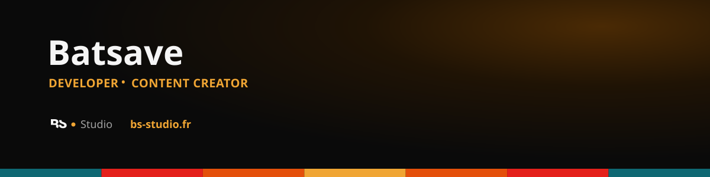

  

 

Développeur front-end (React / Astro) et créateur de contenu, basé en France.
Je conçois et développe des interfaces web soignées, de la maquette au déploiement.

 

## Projets

<table>
  <tr>
    <td width="50%" valign="top">
      <h3>BS Studio</h3>
      
Portfolio, articles techniques et retours d'expérience.

      <a href="https://bs-studio.fr">bs-studio.fr →</a> 
    </td>
    <td width="50%" valign="top">
      <h3>Mes réseaux</h3>
      
Tous mes liens et réseaux sociaux au même endroit.

      <a href="https://bs-studio.fr">bs-studio.fr →</a> 
    </td>
  </tr>
  <tr>
    <td width="50%" valign="top">
      <h3>downloader-studio</h3>
      
Téléchargeur de médias avec file d'attente.   Design, Gratuit et Open Source   MacOS / Windows / Linux

      <a href="https://github.com/Batsave/downloader-studio">Voir le repo →</a> 
    </td>
    <td width="50%" valign="top">
      <h3>project-timeline</h3>
      
Extension VS Code 
      Suivi du temps de dev par projet (Claude Code / Codex CLI, tokens & coûts, git, tests), 100% local.

      <a href="https://github.com/Batsave/project-timeline">Voir le repo →</a> 
    </td>
    
  </tr>
  <tr>
    <td width="50%" valign="top">
      <h3>DEV-Recap</h3>
      
Documentation 
      Site reprenant les bases du développement web, réalisé pendant ma formation.

      <a href="https://github.com/Batsave/DEV-Recap">Voir le repo →</a>  
      <a href="https://dev.batsave.tv">Voir le site →</a> 
    </td>
    <td width="50%" valign="top">
      <h3>UIX-Recap</h3>
      
Documentation 
      Site reprenant les bases du design UX/UI, réalisé pendant ma formation.

      <a href="https://github.com/Batsave/UIX-Recap">Voir le repo →</a>  
      <a href="https://uix.batsave.tv">Voir le site →</a> 
    </td>
  </tr>
</table>

## Stack

Je code aussi avec l'assistance d'outils IA (Claude Code, etc.) pour aller plus vite sur les langages que je maîtrise moins bien — ça fait partie de ma façon de travailler, pas un raccourci que je cache. [J'en parle plus en détail ici →](https://bs-studio.fr/blog/ia-a-change-ma-vision-du-developpement)

## Infra & déploiement

## Stats

  
  

  

## Derniers articles

<!-- BLOG-POST-LIST:START -->
<!-- BLOG-POST-LIST:END -->
